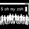

## About
Manage your dotfiles across multiple diverse machines, securely.

## Docs
[chezmoi.io](https://chezmoi.io/)

## Install
```
sh -c "$(curl -fsLS get.chezmoi.io)" -- init --apply maxdzyubak
```
or go to
[chezmoi.io/install](https://www.chezmoi.io/install/)
## Updating your dotfiles on any machine is a single command:
```
chezmoi update
```
## Using tools
| | Name | Site | GitHub Repo | My config |
| --- | :--- | ---- | ------ | :---- |
|| Vim |[vim.org](https://www.vim.org/)| [vim/vim](https://github.com/vim/vim) | [config](https://github.com/maxdzyubak/dotfiles/tree/main/dot_vim) |
|| Homebrew | [brew.sh](https://brew.sh/]) | [brew](https://github.com/Homebrew/brew) | [config](https://github.com/maxdzyubak/dotfiles/blob/main/Brewfile) |
|| Ohmyzsh | [ohmyz.sh](https://ohmyz.sh/) | [ohmyzsh](https://github.com/ohmyzsh/ohmyzsh) | [config](https://github.com/maxdzyubak/dotfiles/blob/main/dot_zshrc) |
|| VSCode | [code.visualstudio.com](https://code.visualstudio.com/) | [vscode](https://github.com/Microsoft/vscode/) | [config](https://github.com/maxdzyubak/dotfiles/tree/main/private_Library/private_Application%20Support/private_Code/User) |
|| iTerm2 | [iterm2.com](https://iterm2.com/) | [iTerm2](https://github.com/gnachman/iTerm2) | [config](https://github.com/maxdzyubak/dotfiles/tree/main/iterm2) |
|| Alacritty | [alacritty.org](https://alacritty.org/) | [alacritty](https://github.com/alacritty/alacritty) | [config](https://github.com/maxdzyubak/dotfiles/blob/main/dot_config/alacritty/alacritty.yml) |
|| Karabiner | [karabiner-elements.pqrs.org](https://karabiner-elements.pqrs.org/) | [Karabiner-Elements](https://github.com/pqrs-org/Karabiner-Elements) | [config](https://github.com/maxdzyubak/dotfiles/blob/main/dot_config/private_karabiner/private_karabiner.json) |
|| Raycast | [raycast.com](https://www.raycast.com/) | [raycast](https://github.com/raycast) | [config](https://github.com/maxdzyubak/dotfiles/tree/main/dot_config/raycast) |
|| Homerow.app | [homerow.app](https://www.homerow.app/) | [homerow](https://github.com/dexterleng/homerow) |
|| Rectangleapp/pro | [rectangleapp.com/pro](https://rectangleapp.com/pro) | [RectanglePro](https://github.com/rxhanson/RectanglePro-Community) | [config](https://github.com/maxdzyubak/dotfiles/blob/main/dot_config/RectangleProConfig.json) |
|| Fig | [fig.io](https://fig.io/) | [fig.io](https://github.com/withfig) |  |
|| fd | | [sharkdp/fd](https://github.com/sharkdp/fd) | |
|| tmux | | [tmux](https://github.com/tmux/tmux) | [config](https://github.com/maxdzyubak/dotfiles/blob/main/dot_config/tmux/tmux.conf) |
|| Exa | [the.exa.website](https://the.exa.website/) | [ogham/exa](https://github.com/ogham/exa) | [config](https://github.com/maxdzyubak/dotfiles/blob/main/dot_zshrc) |
|| ripgrep | | [BurntSushi/ripgrep](https://github.com/BurntSushi/ripgrep) | |
|| zoxide | | [ajeetdsouza/zoxide](https://github.com/ajeetdsouza/zoxide) | |
|| zoxide | | [eradman/entr](https://github.com/eradman/entr) | |
|| Powerlevel10k | []() | [powerlevel10k](https://github.com/romkatv/powerlevel10k) | [config](https://github.com/maxdzyubak/dotfiles/blob/main/dot_p10k.zsh) |
|| The Silver Searcher | [geoff.greer.fm/ag/](https://geoff.greer.fm/ag/) | [the_silver_searcher](https://github.com/ggreer/the_silver_searcher) | |
|| Lsd | []() | [sd-rs/lsd](https://github.com/lsd-rs/lsd) | [config](https://github.com/maxdzyubak/dotfiles/blob/main/dot_zshrc) |
|| Bat | []() | [sharkdp/bat](https://github.com/sharkdp/bat) | [config](https://github.com/maxdzyubak/dotfiles/blob/main/dot_zshrc) |
|| Diff-so-fancy | []() | [diff-so-fancy](https://github.com/so-fancy/diff-so-fancy) | |

## License
[MIT](https://opensource.org/license/mit/)
